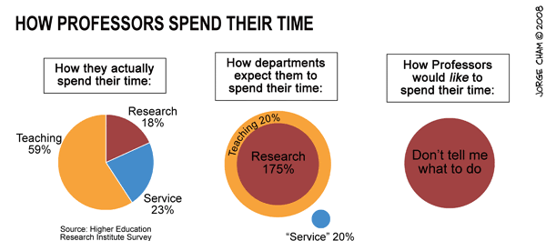

<!--  -->

**Welcome to my personal website, not necessary updated!**

!!! info ""
    From september 2019, I moved to Evry - Paris Saclay where I am a full professor, working at `IBISC lab`.

## [Research Interests](research.md)

My main research interests are `Computer Vision and Machine Learning`.  
I am, in particular, interested in the following subjects:

* `Segmentation, Detection and Tracking`
* `Pattern recognition`
* `Medical image analysis`
* `Autonomous vehicles`

## [Publications](publications.md)

Some papers can be downloaded here. If not, do not hesitate to send me an email.

* dblp [profile](https://dblp.uni-trier.de/pid/02/2939.html){:target="_blank"}
* google scholar [profile](https://scholar.google.fr/citations?user=RuWlFUsAAAAJ&hl=en){:target="_blank"}
* publications by [years](publications.md)

## News

* I have started serving as an Associate Editor for `IEEE RA-L` journal.
* One paper accepted for publication in `Pattern Recognition`, January 2023.
* One paper accepted for publication in `Sensors`, December 2022.
* One paper accepted for publication in `Journal of Intelligent & Robotics Systems`, November 2022.
* My student Marc Blanchon successfully defended his PhD thesis on October 1st, 2021 ! Bravo Dr Marc !
* I promote the usage of the [ha-index](https://www.irif.fr/~haberm/haindex.html), since you can be sure that your ha-index will be greater than your h-index ! 
* My student Yifei Zhang successfully defended her PhD thesis on January 19th ! Bravo Dr Yifei !
* One paper accepted for publication in `Multimedia Tools and Application`, January 2021.
* A PhD thesis proposal is available, see details [here](https://sites.google.com/view/dsidibe/jobs)
* A master thesis (5-6 months) is available from February 2021. See [here](https://sites.google.com/view/dsidibe/jobs).
* Four papers accepted at `ICPR` 2020. Congrats to Marc and Yifei !
* One paper accepted for publication in `Image and Vision Computing`, September 2020
* One paper accepted for publication in `International Journal of Computer Vision`, August 2020
* Nathan Piasco succesfully defended his PhD thesis on Nov 2019, 2019! Bravo !.
* Best Vision Paper award finalist, `ICRA` 2019, congrats to Nathan !
* Spotlight presentation, `BMVC 2019`
* I am been elevated to IEEE Senior Membership, 2019
* One paper accepted for publication at `ICIP` 2019
* Two papers accepted for publication at `VISAPP` 2019
