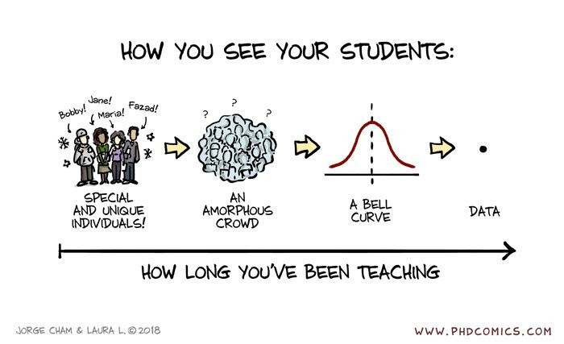

<!--  -->

{ width="400", height="200", align=top }

## Thesis Commitee

| Name | School | Year | Role |
| :--- | :--- | :--- | :--- |
| **Sakhi Shokouh** | IMT Mines Alès | 2022 | *Reviewer* |
| **Yanis Marchand** | Université Gustave Eiffel | 2022 | *Reviewer* |
| **Yonglin Zhang** | Université de Bourgogne Franche-Comté | 2022 | *Reviewer* |
| **Jing Zhang** | Normandie Université | 2022 | *Reviewer* |
| **Priyadarshiny Dhar** | Indian Institute of Technology Dhanbad | 2022 | *Reviewer* |
| **Ashvaany Egambaram** | Universiti Teknologi Petronas (Malaysia) & Université de Bourgogne | 2020 | *Reviewer* |
| **Benedetta Savelli** | University of Cassino (Italy) | 2020 | *Reviewer* |
| **Lamees Nasser K. Mahmoud** | Sorbonne Université | 2019 | *Reviewer* |
| **Hugo Lafaye de Micheaux** | Université de Lyon | 2017 | *Examiner* |
| **Mohamad Motasem Nawaf** | Université St-Etienne | 2014 | *Examiner* |
| **Jean-Louis Palomares** | Université de Montpellier | 2012 | *Examiner* |
| **Jhimli Mitra** | Université de Bourgogne | 2012 | *Examiner* |

---
## Student Supervision

### Current

| Name | Level | Year | Info |
| :--- | :---- | :--- | :--- |
| Sijie Hu | PhD | 2020-2023 || 
| Abanob Soliman | PhD | 2020-2023 | |

### Past PhDs

| Name | Year | Info |
| :--- | :--- | :--- |
| **Marc Blanchon** | 2021 | [https://blanchonmarc.github.io/](https://blanchonmarc.github.io/){ target="_blank" } |
| **Yifei Zhang** | 2020 | |
| **Rami Safarjalani** | 2020 | |
| **Nathan Piasco** | 2019 | [https://umrlastig.github.io/np_homepage/](https://umrlastig.github.io/np_homepage/){  target="_blank" } | 
| **Mazen Hittawee** | 2015 | [fr.linkedin.com/in/mazen-hittawe-4a9838b9](fr.linkedin.com/in/mazen-hittawe-4a9838b9){  target="_blank" } | 
| **Yasir Salih** | 2015 | [scholar.google.com.my/citations?user=ZvtjLCYAAAAJ&hl=en](scholar.google.com.my/citations?user=ZvtjLCYAAAAJ&hl=en){  target="_blank" } | 
| **Satya Muddamsetty** | 2014 | [dk.linkedin.com/in/satya-mahesh-muddamsetty-3a7535144](dk.linkedin.com/in/satya-mahesh-muddamsetty-3a7535144){  target="_blank" } | 
| **François Rameau** | 2014 | [https://rameau-fr.github.io/](https://rameau-fr.github.io/){  target="_blank" } | 

### Past Masters

| Name | Year | Info |
| :--- | :--- | :--- |
| **Han Yuan Fu** | 2021| |
| **Marc Blanchon** | 2018 | [https://blanchonmarc.github.io/](https://blanchonmarc.github.io/){ target="_blank" } |
| **Ezequiel De La Rosa** | 2018 | `Best MAIA thesis award` |
| **Anas Mahna** | 2016 | |
| **Jilliam Diaz Barros** | 2014 | [av.dfki.de/members/barros/](av.dfki.de/members/barros/){ target="_blank"} |
| **Alberto Quintero Delgado** | 2014 | [fr.linkedin.com/in/ajquintero](fr.linkedin.com/in/ajquintero){ target="_blank" } |
| **Ibrahim Sadek** | 2014 | [www.linkedin.com/in/ibrahim-sadek-78830075/](www.linkedin.com/in/ibrahim-sadek-78830075/){ target="_blank" } |
| **Andru Putra Tiwanda** | 2013 | [fr.linkedin.com/in/andru-putra-twinanda-8105103a](fr.linkedin.com/in/andru-putra-twinanda-8105103a){ target="_blank" } |
| **Kedir Adal** | 2012 | [nl.linkedin.com/in/kediradal](nl.linkedin.com/in/kediradal){ target="_blank" } |
| **Sharib Ali** | 2012 | [scholar.google.com/citations?user=NX8ifFkAAAAJ&hl=en](scholar.google.com/citations?user=NX8ifFkAAAAJ&hl=en){ target="_blank" } |
| **Danda Pani Paudel** | 2012 | `Best VIBOT thesis award`   [scholar.google.ch/citations?user=W43pvPkAAAAJ&hl=en](scholar.google.ch/citations?user=W43pvPkAAAAJ&hl=en){ target="_blank" } |
| **Abhilash Srikantha** | 2012 | [scholar.google.de/citations?user=aWhlrPwAAAAJ&hl=en](scholar.google.de/citations?user=aWhlrPwAAAAJ&hl=en){ target="_blank" } |
| **Darshan Venkatrayappa** | 2012| |
| **François Rameau** | 2011| [https://rameau-fr.github.io/](https://rameau-fr.github.io/){  target="_blank" } |
| **Bishesh Khanal** | 2011| [bishesh.github.io/](bishesh.github.io/){ target="_blank" } |
| **Valentine Vega** | 2011| |
